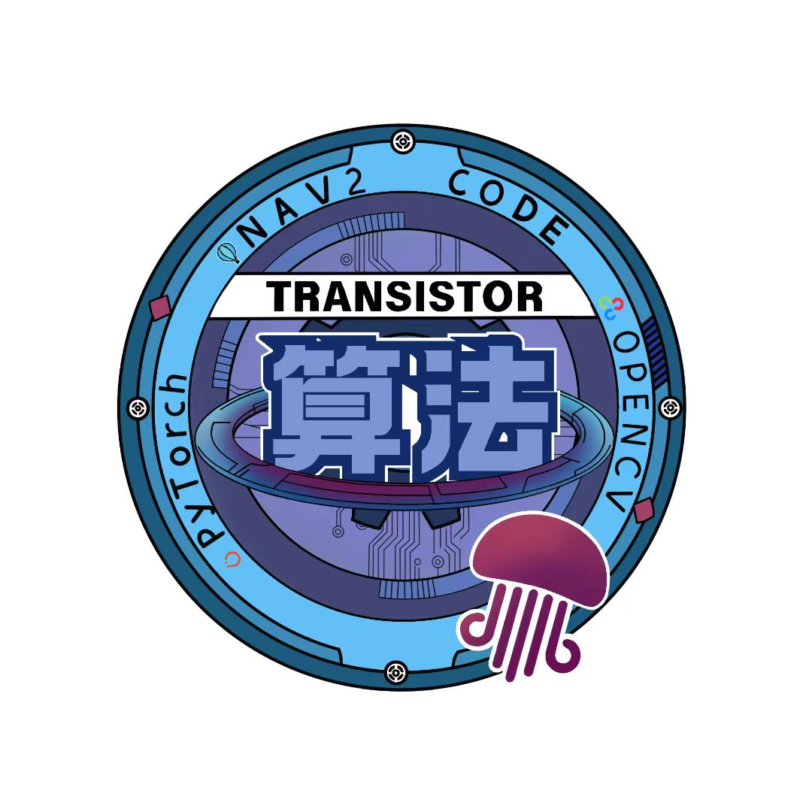

# 北航Transistor战队27赛季哨兵工作空间🐧
## 🐧GUGANAV🐧


北航 Transistor 战队 RoboMaster 27 赛季哨兵机器人导航工作空间。项目基于ROS 2 Humble实现。

致力于打造🐧咕咕嘎嘎🐧也能学会的导航代码仓库！

<p align="center">
  
</p>

## 目录

- [北航Transistor战队27赛季哨兵工作空间🐧](#北航transistor战队27赛季哨兵工作空间)
  - [🐧GUGANAV🐧](#guganav)
  - [目录](#目录)
  - [项目特性](#项目特性)
  - [仓库结构](#仓库结构)
  - [环境要求](#环境要求)
  - [安装依赖](#安装依赖)
    - [准备仿真 PCD 地图](#准备仿真-pcd-地图)
  - [构建](#构建)
  - [使用方法](#使用方法)
    - [仿真导航](#仿真导航)
    - [仿真建图](#仿真建图)
    - [实车导航](#实车导航)
    - [实车建图](#实车建图)
    - [导航与决策联调](#导航与决策联调)
    - [保存地图](#保存地图)
  - [测试与检查](#测试与检查)
  - [开发规范](#开发规范)
  - [常见问题](#常见问题)
  - [致谢](#致谢)
  - [贡献](#贡献)
  - [许可证](#许可证)

## 项目特性

- 基于 Navigation2 的实车和仿真导航启动体系。
- 支持 SLAM、地图加载、Point-LIO 里程计和 small_gicp 重定位。
- 包含 JPS 全局规划、B-spline 轨迹优化和 Nav2 自定义插件。
- 提供全向 PID Pure Pursuit 控制器和 acados MPC 控制器。
- 集成 Livox 雷达、串口通信、手柄调试和工业相机接口。
- 提供 Gazebo/RMOSS 仿真资源、点云适配工具和 RViz 配置。
- 配置 pre-commit 与核心包测试，覆盖地形分析、控制、决策和 JPS 模块。

## 仓库结构

```text
guganav/
├── src/
│   ├── guga_bringup/        # 实车/仿真 launch、Nav2 参数、地图、RViz 配置
│   ├── guga_interfaces/     # 自定义 msg/srv/action
│   ├── guga_description/    # 机器人 URDF/Xacro/SDF 相关描述
│   ├── guga_driver/         # 雷达、串口、相机、手柄等驱动
│   ├── guga_perception/     # 地形分析、点云转换、代价地图层
│   ├── guga_localization/   # Point-LIO 和 GICP 重定位
│   ├── guga_planner/        # Nav2 插件、JPS、B-spline 优化
│   ├── guga_controller/     # PID/MPC 控制器和速度适配
│   ├── guga_decision/       # 决策节点和行为树相关代码
│   ├── guga_sim/            # Gazebo/RMOSS 仿真资源与工具
│   └── guga_ui*/            # UI 模块和历史 UI 代码
├── scripts/                 # 构建、仿真、建图、测试、提交辅助脚本
├── docs/                    # 编码规范、测试诊断、性能测试、重构验证
├── autostart/               # 自启动相关配置
├── rosbag/                  # 本地 rosbag 数据目录
└── build/ install/ log/     # colcon 产物，已被 COLCON_IGNORE 忽略
```

## 环境要求

推荐环境：

- Ubuntu 22.04
- ROS 2 Humble
- C++17
- colcon
- Navigation2、slam_toolbox、PCL、Eigen3 等 ROS/系统依赖

按使用场景准备额外依赖：

| 依赖 | 用途 |
| --- | --- |
| Livox SDK / `livox_ros_driver2` | Livox 雷达驱动 |
| 海康 MVS SDK | `hik_driver` 工业相机驱动 |
| acados | `mpc_controller` 的 MPC 求解器 |
| Pangolin / OpenGL | Pangolin UI 或历史 UI 模块 |

acados 默认按本地路径 `~/tools/acados` 使用：

```bash
export ACADOS_SOURCE_DIR=$HOME/tools/acados
export LD_LIBRARY_PATH=$ACADOS_SOURCE_DIR/lib:${LD_LIBRARY_PATH:-}
```

如果需要重新生成 MPC solver，还需要安装本地 acados Python 接口：

```bash
python3 -m pip install --user -e ~/tools/acados/interfaces/acados_template
```

## 安装依赖

推荐直接使用仓库脚本安装公开 apt/rosdep 依赖和 acados：

```bash
cd ~/guganav
bash scripts/ci/install_deps_humble.sh
source scripts/ci/env_humble.sh
```

`rosdep` 不能处理本地 SDK、手动编译库或队内私有依赖。遇到这类依赖时，请按对应包说明或队内环境文档安装。
国内网络如果访问 GitHub/rosdep 不稳定，可以改用 `rosdepc`：

```bash
USE_ROSDEPC=1 bash scripts/ci/install_deps_humble.sh
source scripts/ci/env_humble.sh
```


### 准备仿真 PCD 地图

仿真导航的非 SLAM 模式会启动 `small_gicp_relocalization`，需要提前准备与 `world`
同名的先验点云地图：

```text
src/guga_bringup/pcd/simulation/<world>.pcd
```

例如 `rmul_2025` 场景对应：

```text
src/guga_bringup/pcd/simulation/rmul_2025.pcd
```

PCD 文件通常较大，不随仓库提交。复制或下载 PCD 后，建议重新构建 `guga_bringup`
让 `install/` 中的资源链接同步：

```bash
cd ~/guganav
colcon build --symlink-install --packages-select guga_bringup
source install/setup.bash
```

如果只是建图或暂时不使用先验 PCD，可以运行 SLAM 模式：

```bash
scripts/simulation.sh map rmul_2025
```

## 构建

推荐使用仓库脚本：

```bash
cd ~/guganav
bash scripts/colconBuild.sh
```

手动构建：

```bash
source /opt/ros/humble/setup.bash
cd ~/guganav
colcon build --symlink-install --cmake-args \
  -DCMAKE_BUILD_TYPE=Release \
  -DCMAKE_EXPORT_COMPILE_COMMANDS=ON
```

如果电脑内存不足或构建时卡死，可以降低并行度：

```bash
source /opt/ros/humble/setup.bash
cd ~/guganav
colcon build --symlink-install --parallel 1 --cmake-args \
  -DCMAKE_BUILD_TYPE=Release \
  -DCMAKE_EXPORT_COMPILE_COMMANDS=ON
```

构建完成后加载工作空间：

```bash
source install/setup.bash
```


## 使用方法

### 仿真导航

一键启动 Gazebo、导航和 RViz：

```bash
cd ~/guganav
scripts/simulation.sh nav
```

指定比赛场景：

```bash
scripts/simulation.sh nav rmul_2025
scripts/simulation.sh nav rmuc_2025 use_rviz:=False
```

### 仿真建图

```bash
cd ~/guganav
scripts/simulation.sh map rmul_2025
```

### 实车导航

```bash
cd ~/guganav
source install/setup.bash
ros2 launch guga_bringup reality_launch.py
```

### 实车建图

```bash
cd ~/guganav
scripts/map.sh
```

### 导航与决策联调

```bash
cd ~/guganav
scripts/nav_decision.sh
```

### 保存地图

```bash
cd ~/guganav
scripts/save_map.sh
```

常用 launch 参数：

| 参数 | 说明 |
| --- | --- |
| `slam:=True|False` | 是否运行 SLAM |
| `world:=rmul_2025` | 选择地图或仿真世界 |
| `use_rviz:=True|False` | 是否启动 RViz |
| `use_communication:=True|False` | 是否启动串口通信 |
| `use_ui:=True|False` | 是否启动 UI |
| `use_robot_state_pub:=True|False` | 是否启动 robot_state_publisher |

## 测试与检查

核心包快速测试入口：

```bash
scripts/pre-commit/run_terrain_analysis_tests.sh
scripts/pre-commit/run_pid_tests.sh
scripts/pre-commit/run_simple_decision_tests.sh
scripts/pre-commit/run_jps_tests.sh
```

手动运行 colcon 测试：

```bash
colcon test --packages-select terrain_analysis
colcon test-result --verbose
```

覆盖率脚本位于 `scripts/test/`，用于本地阶段性质量检查：

```bash
scripts/test/test_terrain_analysis_coverage.sh
scripts/test/test_simple_decision_coverage.sh
scripts/test/test_pb_omni_pid_pursuit_controller.sh
```

## 开发规范

安装并注册 pre-commit：

```bash
python3 -m pip install pre-commit
cd ~/guganav
pre-commit install
```

当前 pre-commit 会在相关文件变化时运行：

| 检查项 | 触发范围 |
| --- | --- |
| clang-format | `terrain_analysis`、PID 控制器、`simple_decision`、`jps_planner` 的 C/C++ 文件 |
| terrain_analysis 测试 | 地形分析包和对应测试脚本 |
| PID 控制器测试 | `pb_omni_pid_pursuit_controller` 和对应测试脚本 |
| simple_decision 测试 | `simple_decision` 和对应测试脚本 |
| jps_planner 测试 | `jps_planner` 和对应测试脚本 |

手动运行全部检查：

```bash
pre-commit run --all-files
```

基本约定：

- C++ 默认使用 C++17。
- 代码格式遵循仓库 `.clang-format`。
- 新增或修改核心逻辑时，优先补充小范围、可重复的单元测试。
- 修改 launch、脚本、配置、地图路径或 Nav2 插件参数后，同步更新 README 或对应子目录文档。
- 在确保稳定性之前不可提交至主线。
- `docs/CODING_STANDARD.md`

## 常见问题

常见问题已单独整理到 [`docs/FAQ.md`](docs/FAQ.md)。

## 致谢

本项目参考并继承了
[深圳北理莫斯科大学 RoboMaster 北极熊战队](https://github.com/SMBU-PolarBear-Robotics-Team)
的开源工作，尤其是 `pb2025_sentry_nav`、`pb_nav2_plugins`、
`pb_omni_pid_pursuit_controller`、`pb2025_robot_description`、
`terrain_analysis`、`rmu_gazebo_simulator` 等导航、仿真和机器人描述相关模块。
感谢北极熊战队对 RoboMaster 社区的开源贡献。

## 贡献

1. 从最新主分支创建功能分支。
2. 修改代码并补充必要测试。
3. 运行相关测试和 `pre-commit run --all-files`。
4. 更新 README、`docs/` 或子目录 README 中受影响的说明。
5. 提交 PR 前说明改动目的、验证方式和已知风险。

## 许可证

本项目使用 Apache-2.0 许可证，见 `LICENSE`。
