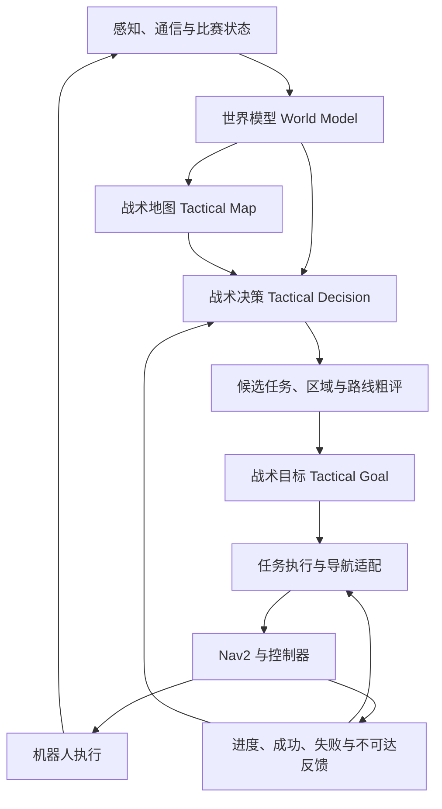

# 烧饼：低算力哨兵决策与战术导航初版方案

> 状态：架构讨论稿，尚未代表已实现能力。  
> 日期：2026-09-24。  
> 范围：明确目标、模块职责、首版技术路线与验证方向；暂不规定消息接口、参数取值、算法细节和代码结构。

## 1. 项目定位

“烧饼”面向 RoboMaster 全自主哨兵，拟在现有 guganav 导航能力之上，构建低算力、可解释、可验证的战术自主系统。

系统需要结合比赛状态、敌我空间关系、自身能力和任务目标，回答四个问题：现在应该做什么、去哪里、走哪条路线，以及执行过程中何时调整。

项目以传统决策、搜索、几何分析和状态估计为基础，不采用大语言模型、深度学习、端到端学习策略或黑箱强化学习作为决策核心。允许使用人工规则、概率模型和传统优化，但是否引入应取决于实际收益与计算预算。

本方案描述决策与战术导航，不扩展为完整感知或火控方案。各类敌情和队友信息必须先确认实际来源与可用性，不能默认具备全局、实时、准确的战场信息。

## 2. 设计原则

- **低算力**：限制候选规模与搜索范围，优先复用静态信息；通过测量确认开销，不预先承诺实时性能。
- **可解释**：能够追溯候选、约束、评价依据和任务切换原因。
- **可验证**：关键逻辑可独立测试，决策可回放，战术收益可通过对照实验评估。
- **模块化**：比赛规则、区域定义、评价偏好与任务流程分开维护。
- **决策与执行解耦**：战术层表达意图，导航与控制层负责可执行运动。
- **闭环运行**：执行结果、信息失效和能力变化必须能反馈到决策层。
- **硬约束优先**：碰撞约束、运动能力和比赛限制不参与收益交换；战术评分不能覆盖不可执行条件。

## 3. 总体架构

建议保留“世界模型—战术地图—战术决策—战术目标—导航执行”的主干，并补充候选路径粗评与执行反馈。

模式管理、执行约束与运行记录贯穿上述流程。图中为逻辑职责，不要求每个模块对应独立进程或节点。

## 4. 核心模块

### 4.1 世界模型：维护事实与估计

世界模型统一维护自身、队友、敌方和环境的结构化状态，不直接选择战术。

除位置、资源、任务和能力外，还应表达信息来源、更新时间、可信程度与未知状态。对暂时丢失的目标保留有限估计，随着信息变旧降低其可信度，避免将“未观测到”解释为“没有威胁”。

首版先梳理信息可获得性：区分直接观测、通信获得、模型推测与暂不可用信息。高层决策只能依赖实际可获得的输入，并对缺失或过期输入采用明确的保守处理。

### 4.2 战术地图：描述空间的战术含义

战术地图在可通行性之外，提供威胁、暴露、遮挡、支援、任务价值与信息不确定性等空间特征。

建议保留可单独查询的特征层，由具体任务决定如何组合，避免一开始就合成固定的万能代价图。首版只引入能够解释、具有可靠输入且可验证的少量特征。

需要明确以下边界：

- 导航可通行性与火力视线遮挡分别表达，不假定二者等价。
- 威胁、暴露和火力覆盖之间明确依赖关系，避免重复计分。
- 队友靠近不自动等于有效支援，支援估计应考虑可用能力与空间条件。
- 未经实验标定的风险指标称为风险代理，不直接称为受击概率。

可考虑用战术区域或拓扑关系表达高层空间，用现有导航地图完成详细几何规划，以控制决策规模。

### 4.3 战术决策：在可行候选之间作出选择

战术层从少量候选任务中选择当前行为，例如防守、占点、支援、撤退、补给、换位或保持当前位置。上述行为是可扩展目录，不要求首版全部实现。

候选应同时包含任务意图与目标区域，并在选择前粗略评价到达代价。评价内容包括任务收益、到达时间、途中风险、信息不确定性和任务切换成本。

先排除不满足硬约束的候选，再比较收益与代价。避免只评价终点位置，选定后才发现路线危险、不可达或无法及时到达。

### 4.4 战术目标：表达任务及其生命周期

战术目标表达“占据某区域”“退回某处”“支援某队友”等意图，由执行层转换为合适的导航落点或执行流程。

除目的地外，目标还应在概念上明确成功、失效、中断与失败条件，以及有效期限和允许的执行方式。到达导航终点不一定等于完成战术任务。

当世界状态变化、目标过期或路径不可达时，执行层应反馈原因，供战术层保持、调整或取消任务。

### 4.5 执行与导航：将意图转成可执行运动

拟复用 guganav 中现有导航与控制能力，通过适配层连接战术目标与导航任务。初期优先研究目标区域和落点选择，后续再按实验需要引入战术路径偏好或运动模式。

职责上，战术层负责任务取舍与战术重选；导航层负责路径规划、跟踪、避障与局部恢复。需要明确局部恢复与高层重选的边界，避免多个模块同时取消、重发或改变任务。

具体接入方式应依据仓库使用的 Nav2 版本与插件能力另行确认，本稿不预设所有扩展均已可用。

## 5. 首版决策方法组合

建议以少量互补机制形成闭环，不同时叠加所有候选框架。

| 层次 | 首版倾向 | 职责 |
| --- | --- | --- |
| 模式与异常管理 | 小型 HFSM | 管理运行模式、异常与降级，约束可用任务 |
| 战术选择 | 带约束的 Utility / 评分决策 | 比较候选任务与位置，说明选择依据 |
| 任务执行 | BT 或显式任务执行器，先选一种 | 组织步骤、等待反馈、处理执行失败 |
| 空间评价 | 区域关系、图搜索与几何分析 | 粗评路线与阵位，衔接详细导航 |

HTN、GOAP、模糊决策等保留为后续选项。只有在固定流程难以表达任务组合、或现有评分确有不足时再引入，不以框架数量衡量系统能力。

避免大量分散的 if-else，重点在于集中管理条件、约束、评价和执行职责；采用新的框架本身并不能消除复杂度。

## 6. 战术导航的研究边界

### 6.1 联合考虑目标与路线

目标位置价值与到达过程应共同参与选择。可先粗评少量候选区域与路线，再对较优候选调用详细规划，避免对所有位置进行高成本搜索。

路径评价关注距离或时间、途中风险、暴露持续时间及运动可行性。任务收益与逐段路径代价分开处理，避免将区域奖励反复累计，产生不合理绕行。

首版不追求统一公式。每项指标应先明确意义、适用条件和尺度，再讨论组合方式；具体搜索方法与代价的兼容性留待实现设计确认。

### 6.2 运动层面的战术策略

速度变化、横向机动和底盘朝向变化可作为后续研究方向，但不预设更快旋转或更随机运动一定更有效。

任何运动策略都应同时考虑受击情况、自身射击表现、定位稳定性、路径跟踪与任务效率，并受到底盘和控制器能力约束。

首版优先完成任务、阵位与路线选择。运动层策略在基础闭环稳定后独立验证，便于区分收益来源。

## 7. 稳定性、降级与可解释性

为避免局势或评分轻微变化造成反复切换，建议设置任务保持、切换门槛和失败候选暂时冷却等机制。紧急情况和目标失效应具有明确优先级，不能被普通保持机制阻塞。

对定位异常、敌情过期、通信缺失、路径不可达或计算超时，应定义能力受限时的处理原则：限制候选、保留仍有效任务、转入保守模式，或在必要时停止执行。具体回退动作根据异常类型与机器人能力确定。

运行记录应能够回答：

- 当时掌握了哪些信息，哪些信息不可靠？
- 比较了哪些候选，哪些被约束排除？
- 为什么保持或切换任务？
- 执行失败发生在哪一层，随后如何处理？

低算力设计还应明确计算预算和超时回退，避免战术计算拖慢导航与控制。更新频率、候选规模和资源上限根据后续测量确定。

## 8. 第一阶段范围与推进路线

第一阶段的目标是：在有限且可能过期的信息下，稳定选择可达、风险合理的战术位置，并在执行失败或目标失效后作出可解释调整。

| 阶段 | 主要工作 | 阶段性产出 |
| --- | --- | --- |
| 信息与基线梳理 | 确认可用输入、现有决策行为、导航反馈和计算余量 | 信息清单与可重复基线场景 |
| 最小闭环 | 选取少量代表性任务，贯通状态、选择、执行与反馈 | 可运行、可解释的闭环原型 |
| 战术空间评价 | 引入少量空间特征，联合评价阵位与路线 | 可对比普通导航的战术版本 |
| 稳定性与降级 | 验证信息失效、任务切换、执行失败和计算受限 | 可回放的异常场景与处理记录 |
| 后续扩展 | 根据证据选择协同、任务规划或运动策略方向 | 独立实验与是否纳入系统的结论 |

首版不要求完整多机器人协同、复杂对手建模、大规模任务规划或完整机动博弈。现有简单决策可作为对照基线，逐项验证后再决定替换范围。

## 9. 验证与评价

验证分为逻辑测试、离线回放、闭环仿真和实机实验。

- **逻辑测试**：检查约束优先级、信息失效、切换与目标生命周期是否符合预期。
- **离线回放**：检查相同记录输入下的决策依据和可复现性；不将回放结果直接视为改变策略后的对抗结果。
- **闭环仿真**：观察决策改变后机器人与环境如何继续演化。
- **实机实验**：确认计算开销、执行能力以及仿真结论的适用范围。

建议逐项比较“固定规则与普通导航”“加入阵位选择”“加入途中风险”“加入不确定性与稳定机制”，后续再单独加入运动策略。使用一致初始条件和可控扰动进行多次重复，避免一次比赛结果决定技术取舍。

评价至少覆盖任务完成率、完成时间、实际损伤或受击情况、无效任务切换、执行失败，以及决策和规划的延迟与资源占用。若仿真尚不具备可信的伤害或火控模型，只能报告风险代理与导航指标，不能据此声称实战生存率提升。

## 10. 下一步需要确认的问题

1. 哪些敌我信息可以稳定获取，哪些必须估计或暂时排除？
2. 第一批任务与实验场景如何选取，现有基线是什么？
3. 现有地图能表达哪些遮挡和战术区域关系？
4. 导航执行能够提供哪些进度、失败和恢复反馈？
5. 战术计算可使用多少资源，超时或失效时如何降级？
6. 哪些指标能够在现有仿真和实机条件下可靠测量？

完成这些确认后，再形成接口设计、数据结构、具体代价模型和实验配置。初版方案优先建立职责清晰、可运行、可测量的闭环。
