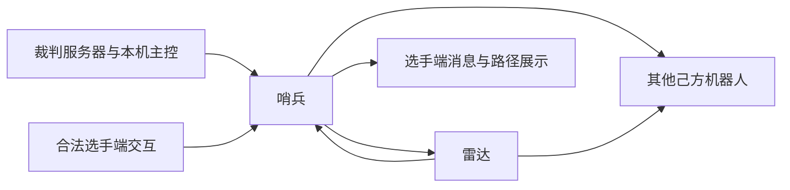

# 烧饼比赛可获取信息清单

> 更新：2026-09-24。依据三份本地官方文件交叉整理。本文区分规则允许、协议提供、队内转发与当前代码接入，不代表全部能力已实机验证。

## 1. 文件依据与赛季边界

| 简称 | 文件 | 用途 |
| --- | --- | --- |
| R26 | [2026 超级对抗赛比赛规则 V2.2.0，20260807](RoboMaster%202026%20机甲大师超级对抗赛比赛规则手册V2.2.0（20260807）.pdf) | 通信权限、哨兵机制、雷达信息来源 |
| P26 | [2026 高校系列赛通信协议 V2.0.0，20260626](RoboMaster%202026%20机甲大师高校系列赛通信协议%20V2.0.0（20260626）.pdf) | 数据内容、接收方、频率与交互方式 |
| F27 | [2027 规则变更前瞻，20260909](RoboMaster%202027%20高校系列赛规则变更前瞻手册（20260909）.pdf) | 下一赛季已公布的变化 |

下文页码均为印刷页码；PDF 阅读器中的物理页码 = 印刷页码 + 1。表号、命令码和章节用于交叉定位。

以 2026 正式规则与协议建立完整基线，用 2027 前瞻标注已知变化。**2027 前瞻没有修改的条款可作为暂定设计假设，但不能视为 2027 正式确认。** F27 第 5 页明确要求最终以后续正式规则为准。本文主要面向 RMUC；P26 中仅适用于 RMUL 的字段不得混入 RMUC 状态。

## 2. 关键修正：哨兵存在主动通信能力

R26 §3.5、表 3-7，第 29 页明确：哨兵可以向所有己方机器人发送数据，但只能接收雷达的数据。

R26 §3.7、表 3-9，第 31 页明确：雷达可以向所有己方机器人发送数据，但只能接收哨兵机器人的数据。

以上是**多机通信**的方向限制，不排除哨兵接收裁判服务器状态、本机主控数据或合法选手端指令。

因此，之前将烧饼描述为“没有主动协同通信手段”不符合 2026 规则基线。应改为：

- 规则允许哨兵向队友发送状态、行动意图、提示或队内约定的协同请求。
- 数据发送能力不等于指挥权；队友执行逻辑或操作手是否响应，需要队内设计。
- 普通队友不能通过该多机链路直接向哨兵回传确认。
- 不能默认搭建“队友 → 雷达 → 哨兵”的转发链路，因为雷达也只允许接收哨兵的多机数据。
- 哨兵与雷达可双向交互；服务器下发队友位置、血量是另一条合法信息来源。

图示为 2026 能力关系，各链路仍受接收对象、控制模式、规则条件与带宽约束；不代表仓库均已实现。

## 3. 哨兵可直接接收的赛事与本机数据

“直接”指协议接收方包含哨兵，通过裁判常规链路到机器人，不需要雷达作为中间来源；仍须下位机与上位机完成转发。频率依据 P26 表 1-5，第 6—8 页，是规定发送频率，不是控制实时性保证。

| 信息 | 命令码 / 发送频率 | 内容与决策意义 | 依据与限制 |
| --- | --- | --- | --- |
| 比赛类型、阶段、阶段剩余时间 | `0x0001` / 1 Hz | 判断开赛、结束和任务剩余窗口；含条件生效的同步时间戳 | P26 表 1-6，第 9 页；UNIX 时间需正确连接裁判 NTP |
| 比赛结果 | `0x0002` / 结束触发 | 红胜、蓝胜或平局 | 表 1-7，第 10 页 |
| 己方主要机器人血量、双方建筑血量、伤害差 | `0x0003` / 3 Hz | 己方英雄、工程、3/4 号步兵、哨兵血量；双方前哨站与基地血量；己方减对方全队总伤害差 | 表 1-8，第 10—11 页；不是全体敌方机器人血量；未上场或罚下也可为零 |
| 场地事件 | `0x0101` / 1 Hz | 协议指定的补给区、高地、堡垒、前哨站、基地等占领状态；能量机关状态；敌方飞镖最近命中时间与目标 | 表 1-9，第 11—12 页；范围有限，中心增益点等字段仅 RMUL 适用 |
| 己方裁判警告 | `0x0104` / 触发及 1 Hz | 判罚等级、违规机器人 ID、次数 | 表 1-10，第 12 页 |
| 飞镖相关状态 | `0x0105` / 1 Hz | 己方飞镖发射剩余时间、最近命中目标、对应累计次数和当前选定目标 | 表 1-11，第 12—13 页；不是飞镖实时轨迹 |
| 本机性能与供电状态 | `0x0201` / 10 Hz | ID、等级、当前及上限血量、冷却值、热量上限、功率上限、弹速上限、云台/底盘/发射机构输出状态 | 表 1-12，第 13—14 页；无需仅凭固定初始参数猜测当前能力 |
| 本机缓冲能量与热量 | `0x0202` / 10 Hz | 缓冲能量、对应发射机构热量 | 表 1-13，第 14 页；前部字段为保留位，不能按旧协议解释为实时电压、电流或功率 |
| 本机裁判定位 | `0x0203` / 1 Hz | x、y、测速模块朝向 | 表 1-14，第 15 页；朝向不是默认等同底盘 yaw；需确认定位模块可用性与坐标变换 |
| 本机增益与能量档位 | `0x0204` / 3 Hz | 回血、冷却增量、防御、负防御、攻击增益，剩余底盘能量的阈值位 | 表 1-15，第 15—16 页；能量位不是精确连续电量，也不是所有 buff 剩余时间 |
| 本机伤害事件 | `0x0206` / 事件触发 | 装甲或模块 ID、协议列出的伤害类别 | 表 1-16，第 16 页；本地判定，以服务器最终伤害为准，不能确定攻击者身份 |
| 本机实际射击反馈 | `0x0207` / 发射触发 | 弹丸类型、发射机构、射速、初速度 | 表 1-17，第 16—17 页；不等于命中反馈 |
| 允许发弹量、金币与堡垒储备 | `0x0208` / 10 Hz | 本机允许发弹量、剩余金币、堡垒储备 17mm 允许发弹量 | 表 1-18，第 17 页；允许发弹量不等于物理弹仓库存；储备值与本机是否实际占领堡垒无关 |
| 本机场地交互检测 | `0x0209` / 3 Hz | 本机检测到的增益点 RFID 卡，包括协议定义的隧道位 | 表 1-19，第 17—19 页；5 字节；赛外即使检测到卡也返回零；不能替代全场占领状态 |
| 己方地面机器人坐标 | `0x020B` / 1 Hz，专发哨兵 | 己方英雄、工程、3 号与 4 号步兵的二维位置 | 表 1-21，第 20 页；末 8 字节为保留位；不含队友速度、任务和意图 |
| 哨兵自主决策状态同步 | `0x020D` / 1 Hz，专发哨兵 | 兑换累计值、远程兑换次数、免费/立即复活资格与金币代价、脱战状态、队伍剩余可兑换弹量、当前姿态及强化标记、能量机关可激活标记、普通/强化姿态剩余可持续时间 | 表 1-23，第 21—23 页；用于确认任务结果，不应只依据本机已发送请求推定成功 |

结论：即使不具备雷达信息波解析能力，按 2026 协议也可以获得相当完整的本机能力、队伍生存状态、建筑局势、队友位置和自身资源操作反馈。基础战术系统不必仅依赖本机视觉与几个血量字段。

## 4. 经雷达获得的敌情：允许，但依赖实际能力

R26 §5.6.6 第 121 页明确列出信息波包含敌方位置、血量、剩余发弹量、增益、经济与增益点占领状态；P26 §1.6 第 39—43 页给出对应结构。

合法且可设计的链路为：**雷达接收并成功解析信息波 → 雷达整理有效数据 → 经 `0x0301` 自定义内容发给哨兵**。这是一条依据现有权限与协议可建立的工程链路，不是裁判服务器自动把所有这些数据下发给哨兵。

| 数据 | 雷达侧命令码 | 明确内容与限制 |
| --- | --- | --- |
| 敌方位置 | `0x0A01` | 英雄、工程、3/4 号步兵、空中机器人、哨兵二维坐标；单位 cm |
| 敌方血量 | `0x0A02` | 英雄、工程、3/4 号步兵、哨兵；其中一个槽位保留，不能宣称包括每种机器人的 HP |
| 敌方允许发弹量 | `0x0A03` | 英雄、3/4 号步兵、空中机器人、哨兵；对应条目包含堡垒储备允许发弹量，不是物理弹量 |
| 敌方宏观状态 | `0x0A04` | 剩余金币、累计金币、指定区域占领状态和场地交互检测状态 |
| 敌方增益及主要状态 | `0x0A05` | 指定地面机器人的回血、冷却、防御、负防御和攻击增益；敌方哨兵姿态；存活、战亡、无敌/虚弱等主要状态 |

源信息波按 P26 表 1-5 标注为 10 Hz。**哨兵端有效更新频率取决于雷达解析、筛选、转发预算与丢包，不能直接记为 10 Hz。** 不应把这里的源坐标当作无误差、无延迟的控制反馈。

雷达还可以依据自身感知向哨兵发送目标观测；自身观测和信息波数据应保留不同来源。`0x020C` 标记/易伤信息与 `0x020E` 雷达自主决策同步原始接收方是雷达，可按需通过允许的雷达到哨兵链路摘要转发，不能作为哨兵直接接收命令登记。

`0x0305` 是雷达到选手端的小地图坐标链路，不是雷达到哨兵的通用接收入口。雷达信息波缺失时，系统退回裁判状态与合法感知可支撑的能力范围。

## 5. 外部任务提示、主动发送与资源操作

### 5.1 哨兵接收高层提示

P26 §1.3.1、表 1-35，第 32—33 页：`0x0303` 提供目标地图坐标或目标机器人 ID、键盘键值和信息来源 ID。云台手可选择己方机器人或广播，发送间隔不低于 0.5 秒；半自动机器人对应操作手的相关发送间隔不低于 3 秒。

该协议触发一次会额外重复发送，并继续以 1 Hz 发送最近一次内容。因此重复收到不能视为新任务或重新计费事件；需要定义任务有效期与去重行为。

R26 §5.6.4，第 114 页进一步规定自动与半自动控制，以及转发小地图标记、补弹、回血、复活和切换姿态等人工干预。自动哨兵每次上述人工操作需花费 50 金币，半自动哨兵无该项费用。这是 2026 基线，不直接断言 2027 沿用。并非所有干预都表现为哨兵上位机收到一个导航目标，部分由服务器改变资源或状态。

### 5.2 哨兵主动通信

P26 `0x0301`，第 23—24 页：子内容 ID `0x0200—0x02FF` 用于机器人间通信，内容最多 112 字节；整个命令字上行最大 30 Hz；每 1000 ms 哨兵与雷达接收上限为 5120 字节，其他列明机器人为 3720 字节。必须同时遵守 R26 的通信方向限制。

可设计的应用包括向队友发送当前意图、路线、危险提示和协同请求，以及向雷达请求重点关注某区域。这些语义需要队内约定，并非官方已经提供的协同指令。不能假定普通队友会回传确认或服从请求。

P26 还提供：

- `0x0307`：哨兵/半自动机器人发送路径和攻击、防守、移动意图用于选手端显示，上限 1 Hz；具体接收端依官方映射确认，不推定它是任意机器人接收接口。
- `0x0308`：向己方选手端发送自定义文本，上限 3 Hz，可用于提示操作手；消息显示不等于操作手接受任务。

### 5.3 哨兵自主向服务器执行动作

R26 §5.6.4 与 P26 表 1-33，第 29—31 页：通过 `0x0301` 子内容 `0x0120` 向服务器发送确认复活、兑换立即复活、兑换允许发弹量、远程补弹、远程回血、姿态切换与确认能量机关进入激活状态等请求。结合 `0x020D` 和实际资源状态确认结果。

这些动作意味着战术输出不止 Nav2 目标，还包括资源与姿态操作。兑换指令含累计值/次数语义，不能当成可任意重复触发的无状态命令。

## 6. 仍需感知或推断的信息

| 信息 | 合理来源与边界 |
| --- | --- |
| 本机高频位姿、速度、角速度、定位质量 | 本机定位、里程计与控制反馈；1 Hz 裁判定位不替代控制估计 |
| 敌我速度、轨迹趋势 | 连续带时效的观测或坐标估计；不是 `0x020B`、`0x0A01` 直接字段 |
| 队友当前任务与未来意图 | 观测推断或另外被规则允许的明确提示；不能把位置当作承诺 |
| 敌方瞄准方向、计划与未来动作 | 感知与模型推断；上述协议不直接提供 |
| 敌方当前枪管热量、物理弹仓库存 | 上述敌情链路未提供这些精确量；冷却增益不等于当前热量，允许发弹量不等于物理库存 |
| 障碍物与视线遮挡 | 本机传感器与地图；分别处理通行几何与火力几何 |
| 受击风险、火力覆盖、支援价值与区域控制强度 | 根据已知状态和几何关系构建的模型；官方占领标志不等于实际火力控制 |
| 攻击者身份和方向 | 本机伤害事件不直接提供攻击者，需结合感知且保留不确定性 |

对“零值”“没有更新”“未部署”“失联”“真实战亡”分别处理。每条外部观测记录来源、接收时间、可用源时间和有效性，不能把重复发布当作新观测。

## 7. 2027 已知变化与暂定继承

| 项目 | 三文件联合判断 | 对架构的要求 |
| --- | --- | --- |
| 兵种与 ID 语义 | F27 第 6—8 页：英雄与工程合为重装，步兵为两台；P26 仍有旧兵种位置与血量槽位 | 使用角色语义与赛季适配；不能直接把旧工程/英雄槽位映射成新重装 |
| 地图与增益 | F27 第 14—16 页：制高点、隧道、工作台等变化；P26 本身也已包含部分隧道 RFID 位 | 不能因为都叫隧道就视为相同几何与位映射；区域定义、触发条件与协议分别版本化 |
| 自定义终端 | F27 第 12—13 页合并原自定义控制器与客户端，明确终端可获取双方血量、己方经济、剩余时间、关键事件，也可发送哨兵干预 | 保留人机交互入口；终端侧字段不自动成为机器人侧字段 |
| 空中侦察 | F27 第 11 页：空中机器人返回机库后传回信息，可进一步提供给雷达等系统 | 可作为延迟外部观测来源，不能按实时空中广播设计 |
| 哨兵/雷达通信方向 | F27 未明确给出新的哨兵专项通信表 | 暂以 R26 的非对称通信为设计基线，2027 正式规则公布后复核 |
| 哨兵姿态、经济、干预费用与报文结构 | P26/R26 已明确；F27 未给出全量替代说明 | 可以规划对应模块，但不将 2026 数值和字节布局当成 2027 保证 |

## 8. 当前仓库实现与完整协议的差距

对照 [BR 协议](../通信协议.md)、[串口节点实现](../../src/guga_driver/serial_driver/src/serial_driver_node.cpp)、[RobotStatus.msg](../../src/guga_interfaces/msg/RobotStatus.msg) 和 [GameStatus.msg](../../src/guga_interfaces/msg/GameStatus.msg)：

| 当前入口 | 已确认代码行为 | 尚缺内容 |
| --- | --- | --- |
| `publishRefereeData()` | 填入本机血量、允许发弹量、枪管热量、比赛阶段和 RFID | 未经该入口填入剩余时间、金币、完整性能、队友血量/位置、建筑状态和哨兵同步等 |
| `decodeEnemyPos()` | 解码一组 x、y | 身份、坐标系、来源、观测时间和有效标记；不等于完整雷达目标列表 |
| `rfid2ros()` | 按旧 24 个区域位输出 | P26 已为 5 字节并包含更多位，需要重新核对；更不能直接作为 2027 映射 |
| `RobotStatus` / `GameStatus` 定义 | 含有部分预留状态字段 | 定义存在不能证明实际发布有效数据，默认零不能作为观测 |

因此，“规则/协议允许获得”与“烧饼当前已收到”的差距主要是数据接入工程，而不是这些状态在规则上不存在。

P26 自身有需要实现前核对的不一致：`0x0203` 总表长度为 16 字节，详细结构列出 3 个 float（12 字节）；`0x0303` 总表为 15 字节，详细结构合计 12 字节；`0x0307` 总表为 103 字节，详细结构含发送者 ID 后合计 105 字节。不要据本文直接实现字节解码，应对照官方配套定义、后续勘误与实际帧验证。

## 9. 对烧饼架构的结论

1. **可规划较完整的赛事状态输入。** 本机能力、队友位置与血量、建筑局势、经济和自身姿态/兑换反馈均有 2026 协议依据，不必全部从感知推测。
2. **雷达是可选的高价值敌情入口。** 有信息波解析能力时，世界模型可显著丰富；没有时，保留裁判状态与本机感知闭环。
3. **协同设计采用非对称通信。** 支持主动发意图、提示与请求，但不依赖普通队友直接确认；雷达与哨兵可双向配合。
4. **战术输出分三类。** 导航任务、资源/姿态操作、对外信息发送，分别执行并记录结果。
5. **推断只覆盖真正未知的部分。** 不必推断已有官方字段，但必须估计时延影响、轨迹趋势、意图与战术风险。
6. **按赛季适配输入与规则。** 以 2026 能力清单作为开发基线，把 2027 已知差异隔离；未来正式文件用于核对变化，而不是等待它们后才能开展所有设计。

建议接入顺序：补齐比赛/本机/资源状态 → 己方坐标与血量、建筑和场地事件 → 哨兵操作反馈 → 雷达敌情 → 意图发布与选手端交互。每步明确来源、权限、时效与无数据时的行为。
