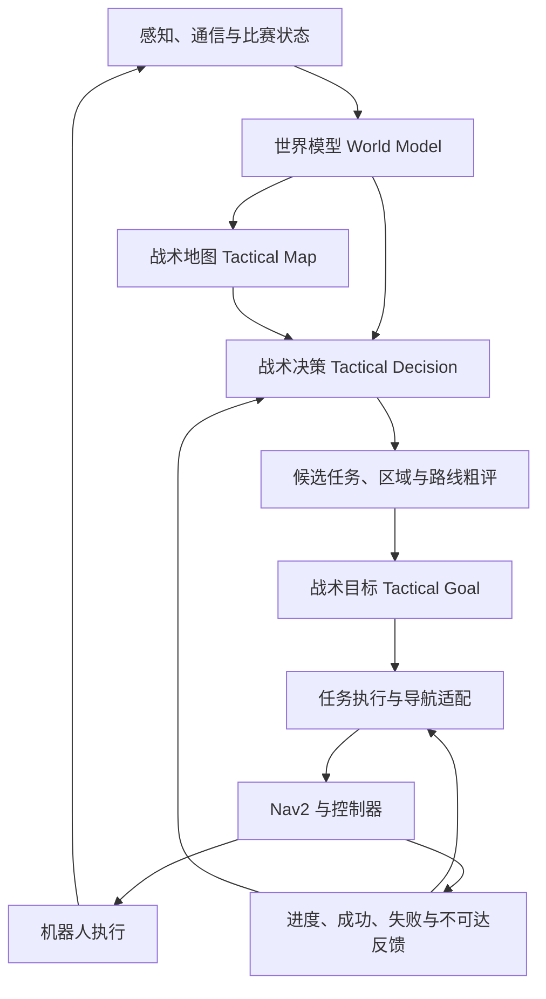
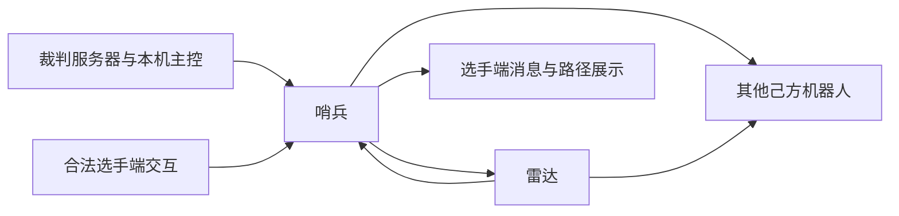

# 烧饼：低算力哨兵决策与战术导航初版方案

> 状态：架构讨论稿，尚未代表已实现能力。  
> 日期：2026-09-24。  
> 范围：明确目标、模块职责、首版技术路线与验证方向；暂不规定消息接口、参数取值、算法细节和代码结构。

## 1. 项目定位

“烧饼”面向 RoboMaster 全自主哨兵，拟在现有 guganav 导航能力之上，构建低算力、可解释、可验证的战术自主系统。

系统需要结合比赛状态、敌我空间关系、自身能力和任务目标，回答四个问题：现在应该做什么、去哪里、走哪条路线，以及执行过程中何时调整。

项目以传统决策、搜索、几何分析和状态估计为基础，不采用大语言模型、深度学习、端到端学习策略或黑箱强化学习作为决策核心。允许使用人工规则、概率模型和传统优化，但是否引入应取决于实际收益与计算预算。

本方案描述决策与战术导航，不扩展为完整感知或火控方案。各类敌情和队友信息必须先确认实际来源与可用性，不能默认具备全局、实时、准确的战场信息。

## 2. 设计原则

- **低算力**：限制候选规模与搜索范围，优先复用静态信息；通过测量确认开销，不预先承诺实时性能。
- **可解释**：能够追溯候选、约束、评价依据和任务切换原因。
- **可验证**：关键逻辑可独立测试，决策可回放，战术收益可通过对照实验评估。
- **模块化**：比赛规则、区域定义、评价偏好与任务流程分开维护。
- **决策与执行解耦**：战术层表达意图，导航与控制层负责可执行运动。
- **闭环运行**：执行结果、信息失效和能力变化必须能反馈到决策层。
- **硬约束优先**：碰撞约束、运动能力和比赛限制不参与收益交换；战术评分不能覆盖不可执行条件。

## 3. 总体架构

建议保留“世界模型—战术地图—战术决策—战术目标—导航执行”的主干，并补充候选路径粗评与执行反馈。

模式管理、执行约束与运行记录贯穿上述流程。图中为逻辑职责，不要求每个模块对应独立进程或节点。

## 4. 核心模块

### 4.1 世界模型：维护事实与估计

世界模型统一维护自身、队友、敌方和环境的结构化状态，不直接选择战术。

除位置、资源、任务和能力外，还应表达信息来源、更新时间、可信程度与未知状态。对暂时丢失的目标保留有限估计，随着信息变旧降低其可信度，避免将“未观测到”解释为“没有威胁”。

按以下清单区分直接观测、通信获得、模型推测与暂不可用信息。高层决策只能依赖实际可获得的输入，并对缺失或过期输入采用明确的保守处理。

以下清单以信息语义为主，命令码与频率用于来源追溯，不规定字节布局或队内消息格式。“规则与协议可获取”不等于当前已接入或始终有效。

#### 4.1.1 信息依据与赛季边界

| 简称 | 文件 | 用途 |
| --- | --- | --- |
| R26 | [2026 超级对抗赛比赛规则 V2.2.0，20260807](RoboMaster%202026%20机甲大师超级对抗赛比赛规则手册V2.2.0（20260807）.pdf) | 通信权限、哨兵机制、雷达信息来源 |
| P26 | [2026 高校系列赛通信协议 V2.0.0，20260626](RoboMaster%202026%20机甲大师高校系列赛通信协议%20V2.0.0（20260626）.pdf) | 数据内容、接收方、频率与交互方式 |
| F27 | [2027 规则变更前瞻，20260909](RoboMaster%202027%20高校系列赛规则变更前瞻手册（20260909）.pdf) | 下一赛季已公布的变化 |

下文页码均为印刷页码；PDF 阅读器中的物理页码 = 印刷页码 + 1。表号、命令码和章节用于交叉定位。

以 2026 正式规则与协议建立完整基线，用 2027 前瞻标注已知变化。**2027 前瞻没有修改的条款可作为暂定设计假设，但不能视为 2027 正式确认。** F27 第 5 页明确要求最终以后续正式规则为准。本文主要面向 RMUC；P26 中仅适用于 RMUL 的字段不得混入 RMUC 状态。

#### 4.1.2 通信权限

R26 §3.5、表 3-7，第 29 页明确：哨兵可以向所有己方机器人发送数据，但只能接收雷达的数据。

R26 §3.7、表 3-9，第 31 页明确：雷达可以向所有己方机器人发送数据，但只能接收哨兵机器人的数据。

以上是**多机通信**的方向限制，不排除哨兵接收裁判服务器状态、本机主控数据或合法选手端指令。

本方案采用以下通信边界：

- 规则允许哨兵向队友发送状态、行动意图、提示或队内约定的协同请求。
- 数据发送能力不等于指挥权；队友执行逻辑或操作手是否响应，需要队内设计。
- 普通队友不能通过该多机链路直接向哨兵回传确认。
- 不能默认搭建“队友 → 雷达 → 哨兵”的转发链路，因为雷达也只允许接收哨兵的多机数据。
- 哨兵与雷达可双向交互；服务器下发队友位置、血量是另一条合法信息来源。

图示为 2026 能力关系，各链路仍受接收对象、控制模式、规则条件与带宽约束；不代表仓库均已实现。

#### 4.1.3 裁判系统直接提供的信息

“直接”指协议接收方包含哨兵，通过裁判常规链路到机器人，不需要雷达作为中间来源；仍须下位机与上位机完成转发。频率依据 P26 表 1-5，第 6—8 页，是规定发送频率，不是控制实时性保证。

| 信息 | 命令码 / 发送频率 | 内容与决策意义 | 依据与限制 |
| --- | --- | --- | --- |
| 比赛类型、阶段、阶段剩余时间 | `0x0001` / 1 Hz | 判断开赛、结束和任务剩余窗口；含条件生效的同步时间戳 | P26 表 1-6，第 9 页；UNIX 时间需正确连接裁判 NTP |
| 比赛结果 | `0x0002` / 结束触发 | 红胜、蓝胜或平局 | 表 1-7，第 10 页 |
| 己方主要机器人血量、双方建筑血量、伤害差 | `0x0003` / 3 Hz | 己方英雄、工程、3/4 号步兵、哨兵血量；双方前哨站与基地血量；己方减对方全队总伤害差 | 表 1-8，第 10—11 页；不是全体敌方机器人血量；未上场或罚下也可为零 |
| 场地事件 | `0x0101` / 1 Hz | 协议指定的补给区、高地、堡垒、前哨站、基地等占领状态；能量机关状态；敌方飞镖最近命中时间与目标 | 表 1-9，第 11—12 页；范围有限，中心增益点等字段仅 RMUL 适用 |
| 己方裁判警告 | `0x0104` / 触发及 1 Hz | 判罚等级、违规机器人 ID、次数 | 表 1-10，第 12 页 |
| 飞镖相关状态 | `0x0105` / 1 Hz | 己方飞镖发射剩余时间、最近命中目标、对应累计次数和当前选定目标 | 表 1-11，第 12—13 页；不是飞镖实时轨迹 |
| 本机性能与供电状态 | `0x0201` / 10 Hz | ID、等级、当前及上限血量、冷却值、热量上限、功率上限、弹速上限、云台/底盘/发射机构输出状态 | 表 1-12，第 13—14 页；无需仅凭固定初始参数猜测当前能力 |
| 本机缓冲能量与热量 | `0x0202` / 10 Hz | 缓冲能量、对应发射机构热量 | 表 1-13，第 14 页；前部字段为保留位，不能按旧协议解释为实时电压、电流或功率 |
| 本机裁判定位 | `0x0203` / 1 Hz | x、y、测速模块朝向 | 表 1-14，第 15 页；朝向不是默认等同底盘 yaw；需确认定位模块可用性与坐标变换 |
| 本机增益与能量档位 | `0x0204` / 3 Hz | 回血、冷却增量、防御、负防御、攻击增益，剩余底盘能量的阈值位 | 表 1-15，第 15—16 页；能量位不是精确连续电量，也不是所有 buff 剩余时间 |
| 本机伤害事件 | `0x0206` / 事件触发 | 装甲或模块 ID、协议列出的伤害类别 | 表 1-16，第 16 页；本地判定，以服务器最终伤害为准，不能确定攻击者身份 |
| 本机实际射击反馈 | `0x0207` / 发射触发 | 弹丸类型、发射机构、射速、初速度 | 表 1-17，第 16—17 页；不等于命中反馈 |
| 允许发弹量、金币与堡垒储备 | `0x0208` / 10 Hz | 本机允许发弹量、剩余金币、堡垒储备 17mm 允许发弹量 | 表 1-18，第 17 页；允许发弹量不等于物理弹仓库存；储备值与本机是否实际占领堡垒无关 |
| 本机场地交互检测 | `0x0209` / 3 Hz | 本机检测到的增益点 RFID 卡，包括协议定义的隧道位 | 表 1-19，第 17—19 页；5 字节；赛外即使检测到卡也返回零；不能替代全场占领状态 |
| 己方地面机器人坐标 | `0x020B` / 1 Hz，专发哨兵 | 己方英雄、工程、3 号与 4 号步兵的二维位置 | 表 1-21，第 20 页；末 8 字节为保留位；不含队友速度、任务和意图 |
| 哨兵自主决策状态同步 | `0x020D` / 1 Hz，专发哨兵 | 兑换累计值、远程兑换次数、免费/立即复活资格与金币代价、脱战状态、队伍剩余可兑换弹量、当前姿态及强化标记、能量机关可激活标记、普通/强化姿态剩余可持续时间 | 表 1-23，第 21—23 页；用于确认任务结果，不应只依据本机已发送请求推定成功 |

结论：即使不具备雷达信息波解析能力，按 2026 协议也可以获得相当完整的本机能力、队伍生存状态、建筑局势、队友位置和自身资源操作反馈。基础战术系统不必仅依赖本机视觉与几个血量字段。

#### 4.1.4 经雷达转发的信息

R26 §5.6.6 第 121 页明确列出信息波包含敌方位置、血量、剩余发弹量、增益、经济与增益点占领状态；P26 §1.6 第 39—43 页给出对应结构。

合法且可设计的链路为：**雷达接收并成功解析信息波 → 雷达整理有效数据 → 经 `0x0301` 自定义内容发给哨兵**。这是一条依据现有权限与协议可建立的工程链路，不是裁判服务器自动把所有这些数据下发给哨兵。

| 数据 | 雷达侧命令码 | 明确内容与限制 |
| --- | --- | --- |
| 敌方位置 | `0x0A01` | 英雄、工程、3/4 号步兵、空中机器人、哨兵二维坐标；单位 cm |
| 敌方血量 | `0x0A02` | 英雄、工程、3/4 号步兵、哨兵；其中一个槽位保留，不能宣称包括每种机器人的 HP |
| 敌方允许发弹量 | `0x0A03` | 英雄、3/4 号步兵、空中机器人、哨兵；对应条目包含堡垒储备允许发弹量，不是物理弹量 |
| 敌方宏观状态 | `0x0A04` | 剩余金币、累计金币、指定区域占领状态和场地交互检测状态 |
| 敌方增益及主要状态 | `0x0A05` | 指定地面机器人的回血、冷却、防御、负防御和攻击增益；敌方哨兵姿态；存活、战亡、无敌/虚弱等主要状态 |

源信息波按 P26 表 1-5 标注为 10 Hz。**哨兵端有效更新频率取决于雷达解析、筛选、转发预算与丢包，不能直接记为 10 Hz。** 不应把这里的源坐标当作无误差、无延迟的控制反馈。

雷达还可以依据自身感知向哨兵发送目标观测；自身观测和信息波数据应保留不同来源。`0x020C` 标记/易伤信息与 `0x020E` 雷达自主决策同步原始接收方是雷达，可按需通过允许的雷达到哨兵链路摘要转发，不能作为哨兵直接接收命令登记。

`0x0305` 是雷达到选手端的小地图坐标链路，不是雷达到哨兵的通用接收入口。雷达信息波缺失时，系统退回裁判状态与合法感知可支撑的能力范围。

雷达侧还可按队内约定转发以下信息，原始接收方仍为雷达：

| 来源 | 信息 | 边界 |
| --- | --- | --- |
| `0x020C` | 指定敌方机器人的易伤标志、己方机器人的特殊标识、双方空中机器人相关标识及激光瞄准/反制状态 | 是状态位，不是完整连续标记进度 |
| `0x020E` | 双倍易伤触发机会、对方双倍易伤是否生效、己方加密等级、是否可修改密钥 | 需要雷达转发 |
| `0x0A06` | 对方干扰波密钥 | 解析辅助信息，通常不必进入战术核心 |
| 雷达自主感知 | 目标位置及实际感知能力支持的属性 | 与信息波来源分开记录 |

#### 4.1.5 选手端交互信息

P26 §1.3.1、表 1-35，第 32—33 页：`0x0303` 提供目标地图坐标或目标机器人 ID、键盘键值和信息来源 ID。云台手可选择己方机器人或广播，发送间隔不低于 0.5 秒；半自动机器人对应操作手的相关发送间隔不低于 3 秒。

该协议触发一次会额外重复发送，并继续以 1 Hz 发送最近一次内容。因此重复收到不能视为新任务或重新计费事件；需要定义任务有效期与去重行为。

R26 §5.6.4，第 114 页进一步规定自动与半自动控制，以及转发小地图标记、补弹、回血、复活和切换姿态等人工干预。自动哨兵每次上述人工操作需花费 50 金币，半自动哨兵无该项费用。这是 2026 基线，不直接断言 2027 沿用。并非所有干预都表现为哨兵上位机收到一个导航目标，部分由服务器改变资源或状态。

2027 前瞻第 12—13 页明确终端可获取双方血量、己方经济、剩余时间、关键事件播报及机器人图传画面。这些属于终端侧信息，未确认通往哨兵的合法链路前，不视为哨兵直接输入，也不默认能接收队友图像。前瞻第 11 页的空中侦察信息需返回机库后传回，可进一步提供给雷达等系统；到哨兵端需落实链路并保留观测时效。

终端协议中的控制结果反馈不自动等于哨兵上位机收到的数据；本机应结合 `0x020D` 与实际资源、姿态变化确认操作结果。

#### 4.1.6 本机感知与推断信息

| 信息 | 合理来源与边界 |
| --- | --- |
| 本机高频位姿、速度、角速度、定位质量 | 本机定位、里程计与控制反馈；1 Hz 裁判定位不替代控制估计 |
| 敌我速度、轨迹趋势 | 连续带时效的观测或坐标估计；不是 `0x020B`、`0x0A01` 直接字段 |
| 队友当前任务与未来意图 | 观测推断或另外被规则允许的明确提示；不能把位置当作承诺 |
| 敌方瞄准方向、计划与未来动作 | 感知与模型推断；上述协议不直接提供 |
| 敌方当前枪管热量、物理弹仓库存 | 上述敌情链路未提供这些精确量；冷却增益不等于当前热量，允许发弹量不等于物理库存 |
| 障碍物与视线遮挡 | 本机传感器与地图；分别处理通行几何与火力几何 |
| 受击风险、火力覆盖、支援价值与区域控制强度 | 根据已知状态和几何关系构建的模型；官方占领标志不等于实际火力控制 |
| 攻击者身份和方向 | 本机伤害事件不直接提供攻击者，需结合感知且保留不确定性 |

对“零值”“没有更新”“未部署”“失联”“真实战亡”分别处理。每条外部观测记录来源、接收时间、可用源时间和有效性，不能把重复发布当作新观测。

此外，世界模型应接入本机内部反馈与预置知识。这些是设计输入，需要分别验证实现：

| 信息 | 来源 | 用途 |
| --- | --- | --- |
| 当前模式、任务、目标和执行阶段 | 模式管理、决策与任务执行器 | 任务连续性、切换与完成判断 |
| 路径、执行进度、成功/失败/取消及不可达原因 | 导航与执行反馈 | 目标调整与异常恢复 |
| 模块健康、当前可执行能力与故障 | 定位、传感器、控制器和硬件反馈 | 约束候选与降级 |
| 链路状态、数据年龄和输入有效性 | 通信适配与输入管理 | 识别过期或缺失信息 |
| 静态地图、战术区域、通道与候选阵位 | 赛前地图与配置 | 空间先验，动态可用性仍需检查 |

威胁、支援和控制强度等派生结果应与原始观测区分，不回写为不带来源的确定事实。

#### 4.1.7 2027 已知变化与暂定继承

| 项目 | 三文件联合判断 | 对架构的要求 |
| --- | --- | --- |
| 兵种与 ID 语义 | F27 第 6—8 页：英雄与工程合为重装，步兵为两台；P26 仍有旧兵种位置与血量槽位 | 使用角色语义与赛季适配；不能直接把旧工程/英雄槽位映射成新重装 |
| 地图与增益 | F27 第 14—16 页：制高点、隧道、工作台等变化；P26 本身也已包含部分隧道 RFID 位 | 不能因为都叫隧道就视为相同几何与位映射；区域定义、触发条件与协议分别版本化 |
| 自定义终端 | F27 第 12—13 页合并原自定义控制器与客户端，明确终端可获取双方血量、己方经济、剩余时间、关键事件，也可发送哨兵干预 | 保留人机交互入口；终端侧字段不自动成为机器人侧字段 |
| 空中侦察 | F27 第 11 页：空中机器人返回机库后传回信息，可进一步提供给雷达等系统 | 可作为延迟外部观测来源，不能按实时空中广播设计 |
| 哨兵/雷达通信方向 | F27 未明确给出新的哨兵专项通信表 | 暂以 R26 的非对称通信为设计基线，2027 正式规则公布后复核 |
| 哨兵姿态、经济、干预费用与报文结构 | P26/R26 已明确；F27 未给出全量替代说明 | 可以规划对应模块，但不将 2026 数值和字节布局当成 2027 保证 |

#### 4.1.8 当前接入范围

对照 [BR 协议](../通信协议.md)、[串口节点实现](../../src/guga_driver/serial_driver/src/serial_driver_node.cpp)、[RobotStatus.msg](../../src/guga_interfaces/msg/RobotStatus.msg) 和 [GameStatus.msg](../../src/guga_interfaces/msg/GameStatus.msg)：

| 当前入口 | 已确认代码行为 | 尚缺内容 |
| --- | --- | --- |
| `publishRefereeData()` | 填入本机血量、允许发弹量、枪管热量、比赛阶段和 RFID | 未经该入口填入剩余时间、金币、完整性能、队友血量/位置、建筑状态和哨兵同步等 |
| `decodeEnemyPos()` | 解码一组 x、y | 身份、坐标系、来源、观测时间和有效标记；不等于完整雷达目标列表 |
| `rfid2ros()` | 按旧 24 个区域位输出 | P26 已为 5 字节并包含更多位，需要重新核对；更不能直接作为 2027 映射 |
| `RobotStatus` / `GameStatus` 定义 | 含有部分预留状态字段 | 定义存在不能证明实际发布有效数据，默认零不能作为观测 |

因此，“规则/协议允许获得”与“烧饼当前已收到”的差距主要是数据接入工程，而不是这些状态在规则上不存在。

P26 自身有需要实现前核对的不一致：`0x0203` 总表长度为 16 字节，详细结构列出 3 个 float（12 字节）；`0x0303` 总表为 15 字节，详细结构合计 12 字节；`0x0307` 总表为 103 字节，详细结构含发送者 ID 后合计 105 字节。不要据本文直接实现字节解码，应对照官方配套定义、后续勘误与实际帧验证。

详细来源审查与对外操作说明见 [比赛可获取信息清单](SENTRY_AVAILABLE_INFORMATION.md)。

### 4.2 战术地图：描述空间的战术含义

战术地图在可通行性之外，提供威胁、暴露、遮挡、支援、任务价值与信息不确定性等空间特征。

建议保留可单独查询的特征层，由具体任务决定如何组合，避免一开始就合成固定的万能代价图。首版只引入能够解释、具有可靠输入且可验证的少量特征。

需要明确以下边界：

- 导航可通行性与火力视线遮挡分别表达，不假定二者等价。
- 威胁、暴露和火力覆盖之间明确依赖关系，避免重复计分。
- 队友靠近不自动等于有效支援，支援估计应考虑可用能力与空间条件。
- 未经实验标定的风险指标称为风险代理，不直接称为受击概率。

可考虑用战术区域或拓扑关系表达高层空间，用现有导航地图完成详细几何规划，以控制决策规模。

### 4.3 战术决策：在可行候选之间作出选择

战术层从少量候选任务中选择当前行为，例如防守、占点、支援、撤退、补给、换位或保持当前位置。上述行为是可扩展目录，不要求首版全部实现。

候选应同时包含任务意图与目标区域，并在选择前粗略评价到达代价。评价内容包括任务收益、到达时间、途中风险、信息不确定性和任务切换成本。

先排除不满足硬约束的候选，再比较收益与代价。避免只评价终点位置，选定后才发现路线危险、不可达或无法及时到达。

### 4.4 战术目标：表达任务及其生命周期

战术目标表达“占据某区域”“退回某处”“支援某队友”等意图，由执行层转换为合适的导航落点或执行流程。

除目的地外，目标还应在概念上明确成功、失效、中断与失败条件，以及有效期限和允许的执行方式。到达导航终点不一定等于完成战术任务。

当世界状态变化、目标过期或路径不可达时，执行层应反馈原因，供战术层保持、调整或取消任务。

### 4.5 执行与导航：将意图转成可执行运动

拟复用 guganav 中现有导航与控制能力，通过适配层连接战术目标与导航任务。初期优先研究目标区域和落点选择，后续再按实验需要引入战术路径偏好或运动模式。

职责上，战术层负责任务取舍与战术重选；导航层负责路径规划、跟踪、避障与局部恢复。需要明确局部恢复与高层重选的边界，避免多个模块同时取消、重发或改变任务。

具体接入方式应依据仓库使用的 Nav2 版本与插件能力另行确认，本稿不预设所有扩展均已可用。

## 5. 首版决策方法组合

建议以少量互补机制形成闭环，不同时叠加所有候选框架。

| 层次 | 首版倾向 | 职责 |
| --- | --- | --- |
| 模式与异常管理 | 小型 HFSM | 管理运行模式、异常与降级，约束可用任务 |
| 战术选择 | 带约束的 Utility / 评分决策 | 比较候选任务与位置，说明选择依据 |
| 任务执行 | BT 或显式任务执行器，先选一种 | 组织步骤、等待反馈、处理执行失败 |
| 空间评价 | 区域关系、图搜索与几何分析 | 粗评路线与阵位，衔接详细导航 |

HTN、GOAP、模糊决策等保留为后续选项。只有在固定流程难以表达任务组合、或现有评分确有不足时再引入，不以框架数量衡量系统能力。

避免大量分散的 if-else，重点在于集中管理条件、约束、评价和执行职责；采用新的框架本身并不能消除复杂度。

## 6. 战术导航的研究边界

### 6.1 联合考虑目标与路线

目标位置价值与到达过程应共同参与选择。可先粗评少量候选区域与路线，再对较优候选调用详细规划，避免对所有位置进行高成本搜索。

路径评价关注距离或时间、途中风险、暴露持续时间及运动可行性。任务收益与逐段路径代价分开处理，避免将区域奖励反复累计，产生不合理绕行。

首版不追求统一公式。每项指标应先明确意义、适用条件和尺度，再讨论组合方式；具体搜索方法与代价的兼容性留待实现设计确认。

### 6.2 运动层面的战术策略

速度变化、横向机动和底盘朝向变化可作为后续研究方向，但不预设更快旋转或更随机运动一定更有效。

任何运动策略都应同时考虑受击情况、自身射击表现、定位稳定性、路径跟踪与任务效率，并受到底盘和控制器能力约束。

首版优先完成任务、阵位与路线选择。运动层策略在基础闭环稳定后独立验证，便于区分收益来源。

## 7. 稳定性、降级与可解释性

为避免局势或评分轻微变化造成反复切换，建议设置任务保持、切换门槛和失败候选暂时冷却等机制。紧急情况和目标失效应具有明确优先级，不能被普通保持机制阻塞。

对定位异常、敌情过期、通信缺失、路径不可达或计算超时，应定义能力受限时的处理原则：限制候选、保留仍有效任务、转入保守模式，或在必要时停止执行。具体回退动作根据异常类型与机器人能力确定。

运行记录应能够回答：

- 当时掌握了哪些信息，哪些信息不可靠？
- 比较了哪些候选，哪些被约束排除？
- 为什么保持或切换任务？
- 执行失败发生在哪一层，随后如何处理？

低算力设计还应明确计算预算和超时回退，避免战术计算拖慢导航与控制。更新频率、候选规模和资源上限根据后续测量确定。

## 8. 第一阶段范围与推进路线

第一阶段的目标是：在有限且可能过期的信息下，稳定选择可达、风险合理的战术位置，并在执行失败或目标失效后作出可解释调整。

| 阶段 | 主要工作 | 阶段性产出 |
| --- | --- | --- |
| 信息与基线梳理 | 确认可用输入、现有决策行为、导航反馈和计算余量 | 信息清单与可重复基线场景 |
| 最小闭环 | 选取少量代表性任务，贯通状态、选择、执行与反馈 | 可运行、可解释的闭环原型 |
| 战术空间评价 | 引入少量空间特征，联合评价阵位与路线 | 可对比普通导航的战术版本 |
| 稳定性与降级 | 验证信息失效、任务切换、执行失败和计算受限 | 可回放的异常场景与处理记录 |
| 后续扩展 | 根据证据选择协同、任务规划或运动策略方向 | 独立实验与是否纳入系统的结论 |

首版不要求完整多机器人协同、复杂对手建模、大规模任务规划或完整机动博弈。现有简单决策可作为对照基线，逐项验证后再决定替换范围。

## 9. 验证与评价

验证分为逻辑测试、离线回放、闭环仿真和实机实验。

- **逻辑测试**：检查约束优先级、信息失效、切换与目标生命周期是否符合预期。
- **离线回放**：检查相同记录输入下的决策依据和可复现性；不将回放结果直接视为改变策略后的对抗结果。
- **闭环仿真**：观察决策改变后机器人与环境如何继续演化。
- **实机实验**：确认计算开销、执行能力以及仿真结论的适用范围。

建议逐项比较“固定规则与普通导航”“加入阵位选择”“加入途中风险”“加入不确定性与稳定机制”，后续再单独加入运动策略。使用一致初始条件和可控扰动进行多次重复，避免一次比赛结果决定技术取舍。

评价至少覆盖任务完成率、完成时间、实际损伤或受击情况、无效任务切换、执行失败，以及决策和规划的延迟与资源占用。若仿真尚不具备可信的伤害或火控模型，只能报告风险代理与导航指标，不能据此声称实战生存率提升。

## 10. 下一步需要确认的问题

1. 第 4.1 节列出的信息中，哪些已完成端到端接入，哪些仍需验证来源、时效与赛季适配？
2. 第一批任务与实验场景如何选取，现有基线是什么？
3. 现有地图能表达哪些遮挡和战术区域关系？
4. 导航执行能够提供哪些进度、失败和恢复反馈？
5. 战术计算可使用多少资源，超时或失效时如何降级？
6. 哪些指标能够在现有仿真和实机条件下可靠测量？

完成这些确认后，再形成接口设计、数据结构、具体代价模型和实验配置。初版方案优先建立职责清晰、可运行、可测量的闭环。
