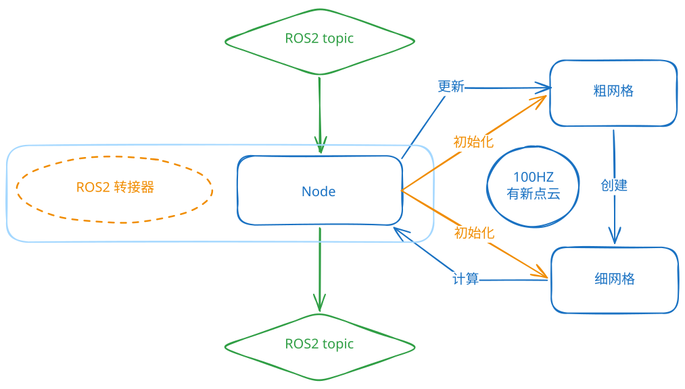

# terrain_analysis

局部地形分析节点，从 LiDAR 点云构建局部高度地图，输出障碍点云 `terrain_map`（`intensity` 为该点距局部地面的高度）。

## 架构



主线只有一条：Timer 回调函数 → `TerrainAnalysis::processOnce()` 跑一帧 → 发布。
详细步骤如下：

1. `src/terrain_analysis_node.cpp` — 订阅、逐帧分发与发布都在这里；
  - 初始化: 使用参数注入, 在 node 里接受 ros2 参数, 支持动态调参; 将接受的参数结构体的常量指针传递给持有类的构造函数, 使之得到只读的参数数据.
  - 循环: 调用 walltimer, 每 10ms 执行一次 processOnce(), 更新,计算,并发布数据.

2. `persistent_voxel_map.hpp` — 前半段（跨帧持续）。
  - 粗网格, 每格 $1m \times 1m$, 负责存储历史点云,并通过时间衰减与高度初步更新并过滤点云,还负责将点云信息注入到缓冲点云中.

3. `per_frame_height_map.hpp` — 后半段（逐帧）。
  - 细网格, 每格 $0.2m \times 0.2m$,从缓冲点云中获取点并重新构建二维点云簇,通过取分位数的方式决定点云的高度,并最终过滤计算出发布点云.

`config.hpp`: 两网格类各自的参数结构体.
`grid.hpp` : 两张网格的尺寸与下标换算
`grid_utils.hpp`坐标 ↔ 格、格 ↔ 点云、单点 ↔ 3×3 邻域的转换函数。


## 管线
本节讲解各函数作用。


| 位置                 | 函数                     | 职责                                                                                                                                  |
| -------------------- | ------------------------ | ------------------------------------------------------------------------------------------------------------------------------------- |
| persistent_voxel_map | `rollover`               | 车体移动时滚动 terrain voxel 网格，维持以**雷达**为中心的滑动窗口                                                                     |
| persistent_voxel_map | `addFrame`               | 当前帧点云按空间位置分配到 terrain voxel 格子                                                                                         |
| persistent_voxel_map | `rebuild`                | 逐格每帧重建：按水平 `scanVoxelSize` 0.1 / 垂直 `scanVoxelSizeZ` 0.05进行下体素采样,只保留**最新观测**点,并进行时间衰减与空间高度过滤 |
| persistent_voxel_map | `collectCloud`           | 收集以雷达所在格为中心 11×11 格子的累积地形点                                                                                         |
| per_frame_height_map | `estimateTerrainGround`  | 将点膨胀到 planar voxel（3×3），收集地面高度候选值                                                                                    |
| per_frame_height_map | `computePlanarElevation` | 对每个 planar voxel 估地面高度（分位数 `quantileZ`，或最小值）                                                                        |
| per_frame_height_map | `computeHeightMap`       | 计算每点离地高度，写入 `intensity` 生成输出点云                                                                                       |


## 测试

```bash
# 单元测试（构建 terrain_analysis 包并运行其测试）
scripts/pre-commit/run_terrain_analysis_tests.sh

# 覆盖率（编译 + 运行 + gcovr 报告）
scripts/test/test_terrain_analysis_coverage.sh
```

| 输出            | 路径                                         |
| --------------- | -------------------------------------------- |
| Html 覆盖率报告 | `build/terrain_analysis/coverage.html`       |
| lcov 信息       | `lcov.info`                                  |
| 测试日志        | `build/terrain_analysis/coverage_result.ans` |

当前 `terrain_analysis` 测试套件：

- `test_terrain_analysis`：完整管线行为
- `test_frame_ingest`：前半段的帧输入（雷达位置与帧时刻、首帧时刻、观测时刻写进
  intensity、越界裁剪、`update` 清待处理标记）
- `test_algorithm`：体素、地面高程估计与边界处理
- `test_integration`：只通过 ROS 话题驱动节点（不直接调 ingest / update / compute），覆盖订阅与消息转换、逐帧数据分发、发布消息的 frame_id/stamp，以及跨帧的幽灵点清除与体素窗口滚动

`estimateTerrainGround` 与 `computeHeightMap` 都经 `gridIndex(...)` 统一做越界判定；
超出 `51×51` planar 网格的点会被忽略，避免数组越界。

## 网格参数

| 网格                | 分辨率 | 尺寸  | 说明                     |
| ------------------- | ------ | ----- | ------------------------ |
| PersistentVoxelGrid | 1.0 m  | 21×21 | 滑动窗口，累积多帧点云   |
| PerFrameHeightGrid  | 0.2 m  | 51×51 | 随车逐帧重建，估地面高度 |

## 参数

参数来自 `src/guga_bringup/config/<profile>/base.yaml` 的 `terrain_analysis:` 段（实车与
仿真各一份），由节点声明后按两半的读取范围分发给两个配置结构体。共 16 个：

| 参数                                                 | 作用                                                               |
| ---------------------------------------------------- | ------------------------------------------------------------------ |
| `scanVoxelSize` / `scanVoxelSizeZ`                   | 融合叶尺寸（水平 0.1 / 垂直 0.05 m）                               |
| `decayTime` / `noDecayDis`                           | 观测的衰减时间与"近处不衰减"半径                                   |
| `maxRelZ` / `disRatioZ`                              | 接收带的上沿与随距离放宽的比例                                     |
| `minRelZ`                                            | 前半段：接收带下沿；后半段：障碍输出的地板（只声明一次，两处同值） |
| `useSorting` / `quantileZ`                           | 地面高度取分位数还是最小值，及分位点                               |
| `considerDrop` / `limitGroundLift` / `maxGroundLift` | 凹坑取绝对值、地面抬升限幅                                         |
| `minBlockPointNum`                                   | 每格参与判定的最少点数                                             |
| `minObstacleHeight` / `ceilingClearance`             | 障碍输出高度带（下界死区、上界净空）                               |
| `groundFloorZ`                                       | 地面候选的绝对高度地板（odom z）                                   |

另外注意：`config.hpp` 里的结构体默认值只有部分是实车值——`decay_time`、`no_decay_distance`、
`quantile_z`、`max_ground_lift`、`max_relative_z` 与 `base.yaml` 不同，单元测试若直接构造
结构体，跑的是默认值而不是实车工况。

## 已知风险：坐标系不统一

管线内部同时使用**三个参考系**，且没有在类型或命名上区分——这是当前最容易被误改的地方。

| 参考系                                   | 定义                                      | 使用位置                                                                                                 |
| ---------------------------------------- | ----------------------------------------- | -------------------------------------------------------------------------------------------------------- |
| odom 世界系                              | `point.z` 绝对值                          | `PersistentVoxelMap` 里体素格的存量、`voxel_elev_` 的数值、`estimateTerrainGround` 的地板 `groundFloorZ` |
| 雷达系（`lidar_*` 取自雷达里程计的位置） | `relative_z = point.z − lidar_position.z` | `PersistentVoxelMap::ingest` 裁剪带、`computeHeightMap` 的地板 `minRelZ`                                 |
| 地面系                                   | `point.z − voxel_elev_[cell]`             | `computeHeightMap` 的净空判据与 `height_above_ground`、输出 intensity                                    |

### 风险 1（已部分修复）：前置筛选带宽随距离放宽、净空曾是常数

`PersistentVoxelMap::ingest` 的裁剪带是 `minRelZ`/`maxRelZ ± disRatioZ × distance`，**带宽随
距离放宽**（近处 ≈ 0，远处 5 m 处 ±1.0 m）。而 `estimateTerrainGround` 原有的净空
上界是**常数**，会把抬升的地面按车高砍掉（坡面失效）。

**该净空上界已移除**（见下节风险 3），地面候选现只受绝对地板 `groundFloorZ` 约束。
但裁剪带仍是雷达系、且近处带宽极窄（约 0.2 m），故 `lidar_z` 的标定误差在**近处**
仍会直接决定"地面点能否进入管线"——远处因带宽放宽而被掩盖。这与仓库根
`docs/TODOLIST.md` 记录的"近处低地面点被忽略"直接相关。

### 风险 2：候选筛选与地面估计互为前提（循环依赖）

筛候选想用"高出局部地面多少"，但局部地面 `elev` 正需要候选才能算。
当前用雷达系（相对雷达高度）绕开了这个循环，代价就是风险 1。

### 风险 3（已修复）：一个参数兼两种语义 → 现仅用于障碍输出

`ceilingClearance` 原先同时表示"隧道净空"（车体属性）与"地面候选高度上限"
（地形属性），调其一必动另一。现已从 `estimateTerrainGround` 移除，**只由
`computeHeightMap` 使用**，语义唯一：距**局部地面**达到该值的点不作为障碍输出。

它也不再与 `maxRelZ` 竞争"上界"角色（后者现仅用于 `PersistentVoxelMap::ingest`
与 `PersistentVoxelMap::keepPoint`）。

### 风险 4（已修复）：`maxRelZ` 曾是死配置

原在 `estimateTerrainGround` 与 `computeHeightMap` 中，`relative_z >= maxRelZ`
永不生效（更紧的净空上界先行）。两处条件均已移除；`maxRelZ` 现仅在
`PersistentVoxelMap::ingest` 与 `PersistentVoxelMap::keepPoint` 生效，不再是死参数。

### 障碍输出高度带（2026-09-17 起：唯一上界）

障碍输出的条件是 `minObstacleHeight <= h < ceilingClearance`，其中 h 是距**局部
地面**的高度。两个边界都作用于输出点云（marking 用途）；清除用的回波不受下界约束。

| 边界 | 参数                | 实车值 | 含义                                              |
| ---- | ------------------- | ------ | ------------------------------------------------- |
| 下界 | `minObstacleHeight` | 0.04 m | 地面带死区，吸收地面高度估计的误差                |
| 上界 | `ceilingClearance`  | 0.62 m | 车高 520 mm + 100 mm 裕量，可从下方通过的不算障碍 |

上界是**唯一**的高度上界（判据用 `>=`，等于 0.62 m 的点也丢弃）。

历史上另有一条 `h < vehicleHeight(0.52)` 的截断。它与净空重叠且更严，会把 0.52 至
0.62 m 之间的点一并丢掉，而这段高度上的悬空结构车是过不去的，属于漏检；2026-09-17
该截断与 `vehicleHeight` 参数一并删除，换车现在只需要重设 `ceilingClearance`。

（更早的历史：净空曾是编译期常量 0.1 m，源自隧道实测顶隙约 260 mm 的裕量取值，
见提交 `3627c76` 恢复为参数。节点启动时原会比较净空与车高并告警，该检查随截断一并
移除，现在改为打印实际生效的高度带。）

### 风险 5：索引相对、数值绝对

`point_elev_[cell]` 的行列下标来自 `point − lidar`（相对），
压入的却是 `point.z`（odom 绝对）。自洽（后续两个绝对值相减），
但极易被改成 `point.z − lidar_z` 而全错。

### 建议的统一方向（尚未实施）

1. **判据统一到地面系**：障碍高度与地面候选筛选都以"距局部地面"为准；
2. **两遍法破循环**：先用最低点估粗地面（最低点对障碍不敏感、坡面稳定），
   再以粗地面为基准筛候选，最后用分位数正式估 `elev`；
3. ~~**拆开 `ceilingClearance`**~~ **已完成**：净空判据已从地面估计阶段移除，
   现只用于障碍输出（见风险 3）；
4. 雷达系只保留给**传感器自身的量**：点云裁剪窗口（安装关系），
   以及以局部地面为基准表达的车顶净空。

### 无需担心的前提

"地面系"依赖 odom z 的**跨帧相对精度**（`elev` 跨帧累积）。当前场景
**不存在长距离下坡**，故长期漂移不构成风险；`point.z` 与 `elev` 同为 odom 量，
其差值天然抵消平移分量。

## 输入

| 节点              | Topic             | 类型                      | 来源包/节点                  |
| ----------------- | ----------------- | ------------------------- | ---------------------------- |
| `terrainAnalysis` | `lidar_odometry`  | `nav_msgs/Odometry`       | `point_lio → loam_interface` |
| `terrainAnalysis` | `registered_scan` | `sensor_msgs/PointCloud2` | `point_lio → loam_interface` |

## 输出

| 节点              | Topic         | 类型                      | 坐标系 | 下游订阅者                                                  |
| ----------------- | ------------- | ------------------------- | ------ | ----------------------------------------------------------- |
| `terrainAnalysis` | `terrain_map` | `sensor_msgs/PointCloud2` | `odom` | `local_costmap` (intensity_voxel_layer, `pb_nav2_plugins`)  |
|                   |               |                           |        | `global_costmap` (intensity_voxel_layer, `pb_nav2_plugins`) |
|                   |               |                           |        | `pointcloud_to_laserscan` (`guga_perception`, 仅 SLAM 模式) |

## 数据流

```
point_lio (cloud_registered, aft_mapped_to_init)
  │
loam_interface
  │
  └─(lidar_odometry)──── terrainAnalysis(terrain_map)
     (registered_scan)    │
                          ├─── local_costmap
                          │    (intensity_voxel_layer, pb_nav2_plugins)
                          │
                          ├─── global_costmap
                          │    (intensity_voxel_layer, pb_nav2_plugins)
                          │
                          └─── pointcloud_to_laserscan (obstacle_scan)
                               └─ slam_toolbox (map)      (仅 SLAM 模式)
```

## 单个节点

本包只提供 `terrainAnalysis` 一个节点（`terrain_analysis_node.cpp`）：输入原始激光
点云 + 里程计，输出 `terrain_map`，由 Nav2 参数文件统一配置。

`terrainAnalysisExt` 与 `terrain_map_ext` **已于 2026-09-17 删除**。它当时只剩
`mergeLocalTerrain` 一个半径过滤器（把 `terrain_map` 里距车 > `localTerrainMapRadius`
的点丢掉再转发，无信息增量），且 4.0 m 比 `local_costmap` 需要的 5 m 还窄，在做负功。
消费者改指 `terrain_map`，属**严格放宽**（≤4 m → ≤±5.1 m，上限由 planar 网格决定）：

| 原消费者                                    | 原输入                    | 现输入                   |
| ------------------------------------------- | ------------------------- | ------------------------ |
| `global_costmap` 的 `intensity_voxel_layer` | `terrain_map_ext`（≤4 m） | `terrain_map`（≤±5.1 m） |
| `pointcloud_to_laserscan`（仅 SLAM 模式）   | `terrain_map_ext`         | `terrain_map`            |

原版 CMU 的远场累积与 `checkTerrainConn` 连通性判定在这套移植里本来就不存在
（参数表是从原版抄的），不是这次删除造成的；若将来需要远场/连通性判定，需另行设计。
详见仓库根 `docs/TODOLIST.md`。
